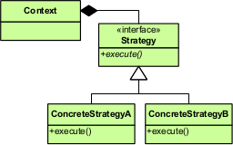

# Relatório

## Alunos
- Guilherme Tavares Shimamoto - 198435
- Natan Beltrão da Cunha Pevidor Carvalho - 184972
- Thiago dos Santos Solera - 224828

## Descrição

Este projeto consiste em um jogo de [Pacman](https://pt.wikipedia.org/wiki/Pac-Man). Ele possui um componente visual implementado com as funcionalidades visuais do módulo `javax.swing`, nativo da linguagem Java.

## Arquitetura

### Strategy Pattern

Para tratar as colisões e movimentos, foi utilizado o padrão de projeto *Strategy*. Para isso, foram criadas a interface `CollisionStrategy` e a classe abstrata `MovingStrategy`.

Todo elemento que aparece no labirinto é uma extensão da classe abstrata `Sprite`, que possui a função `collide`, que, por sua vez, chama a função `collide` da strategy de sua instância, permitindo que diversas formas de tratar a colisão com um jogados fossem possíveis.

Além disso, os elementos capazes de se moverem extendem a classe abstrata `MovingStrategy`, que possui um método `move`, que funciona como a função `collide`, descrita acima.

Uma ilustração do diagrama de classes do *Strategy Pattern* pode ser vista abaixo:

